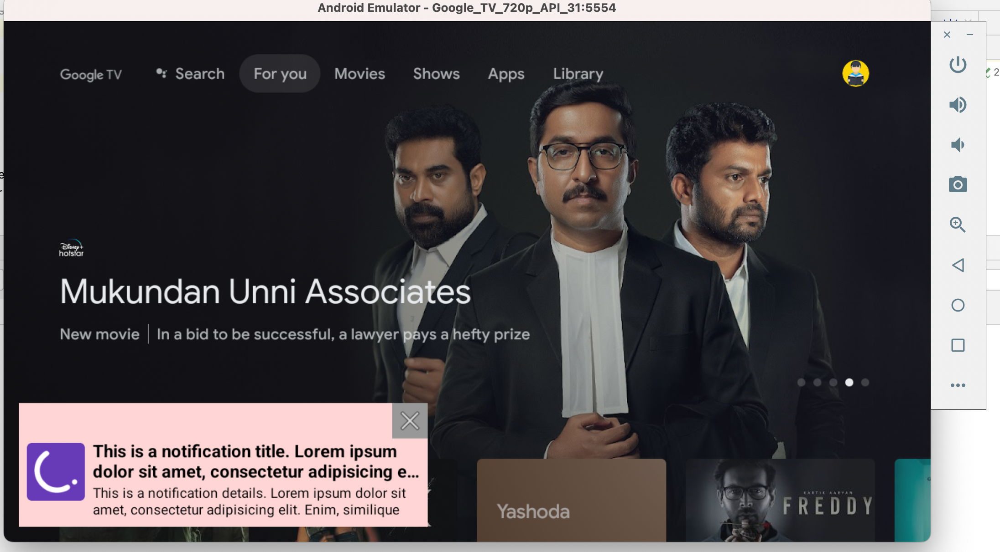

# CleverTap SDK and Notification Integration With Android TV

This is a sample project that shows how to integrate CleverTap SDK  With Android TV and use it to send events and receive notifications 

---

## Introduction to Android for TV
Android SDK for TV's OS are not much different than Android SDK for Mobile. Most of the core components like views, activities, fragments, services, etc work in similar fashion. However, Some classes in core android sdk are not supported for tv and therefore would not work out-of-the-box . For eg, `NotificationManager.notify()` does not create notifications. 
So to have such we features, we use custom workarounds like creating a floating viewand  have a cross button in it which will remove the floating view when pressed. So here are the steps:

### Step 1 Integrate CleverTap SDK , FCM Service in gradle and manifest

For Gradle Files:
```groovy

/* ============ project-root/build.gradle ============ */

//...
buildscript {
    dependencies {
        classpath 'com.google.gms:google-services:4.3.14'
    }
}
//...

/* ============ src/build.gradle ========== */

//...
plugins {
    //...
    id 'com.google.gms.google-services'
}
//...
dependencies {
    implementation "androidx.core:core-ktx:1.7.0"
    implementation "androidx.leanback:leanback:1.0.0"
    implementation "androidx.appcompat:appcompat:1.4.0"
    implementation "androidx.constraintlayout:constraintlayout:2.1.2"

    // google libs
    implementation platform("com.google.firebase:firebase-bom:25.10.0")
    implementation "com.google.firebase:firebase-analytics-ktx"
    implementation "com.google.firebase:firebase-messaging-ktx"
    implementation "com.google.android.gms:play-services-location:18.0.0" 
    implementation "com.google.android.exoplayer:exoplayer:2.15.1"
    implementation "com.google.android.material:material:1.4.0"

    // com.android libs
    implementation "com.android.installreferrer:installreferrer:2.2"
    

    // 3rd party libs
    implementation "com.github.bumptech.glide:glide:4.11.0"
    
    //CLEVERTAP Libs
    implementation "com.clevertap.android:clevertap-android-sdk:4.6.6"
    //implementation "com.clevertap.android:push-templates:1.0.4"
    //implementation "com.clevertap.android:clevertap-hms-sdk:1.3.0"
    //implementation "com.clevertap.android:clevertap-geofence-sdk:1.1.0"
    //implementation "com.clevertap.android:clevertap-xiaomi-sdk:1.4.0"
   

}

/* ============ src/google-services.json ========== */

        {
            /*add your app in a firebase project ,generate google-services.json, and add it in src folder */
        }


```

For manifest files
```xml
<!-- ============ src/main/AndroidManifest.xml ============ -->
<manifest xmlns:android="http://schemas.android.com/apk/res/android">
    
    <!--  required by clevertap sdk  -->
    <uses-permission android:name="android.permission.INTERNET" />
    
    <!--  needed for notification view to float  -->
    <uses-permission android:name="android.permission.SYSTEM_ALERT_WINDOW"/>

    <!-- ... -->
    
    <application android:name=".MainApp">
        <meta-data android:name="CLEVERTAP_ACCOUNT_ID" android:value="YOUR_ACCOUNT_ID" />
        <meta-data android:name="CLEVERTAP_TOKEN" android:value="YOUR_TOKEN" />
        <meta-data android:name="CLEVERTAP_REGION" android:value="YOUR_REGION"/>
    
        <!-- ... -->
        
        <!--  required by clevertap sdk  -->
        <service
            android:name="com.clevertap.ct_demo_androidtv.MyFcmMessageListenerService"
            android:exported="true">
            <intent-filter>
                <action android:name="com.google.firebase.MESSAGING_EVENT" />
            </intent-filter>
        </service>


    </application>

</manifest>

```

## Step2 initialise CleverTap SDK in application class
```kotlin

class MainApp : Application() {

    var ctCoreApi: CleverTapAPI? = null

    override fun onCreate() {
        CleverTapAPI.setDebugLevel(com.clevertap.android.sdk.CleverTapAPI.LogLevel.VERBOSE)
        ActivityLifecycleCallback.register(this)

        super.onCreate()
        ctCoreApi = CleverTapAPI.getDefaultInstance(applicationContext)

        val importance = if (Build.VERSION.SDK_INT >= Build.VERSION_CODES.N) NotificationManager.IMPORTANCE_MAX else 5
        CleverTapAPI.createNotificationChannel(applicationContext, "id", "name", "description", importance, true)

    }
    /*...*/
}
```

## Step3 Add custom FCM  class code

```kotlin

class MyFcmMessageListenerService : FirebaseMessagingService() {
/*make sure this service is part of android manifest, as we did in step 1 */

    override fun onMessageReceived(message: RemoteMessage) {
        super.onMessageReceived(message)
        NotifUtil.floatingNotif(this,message)
    }
}
```

### Step4 Creating Notification everytime a notification is received by FCM

For this, we need to create a helper function that will:
1. create a  notification-like view by inflating an xml layout
2. Set listeners on the view's buttons , extract data from `RemoteMessage` and set it on view's text areas
3. Add it in current window and position it to bottom

Therefore we create this xml layout : 
```xml
<?xml version="1.0" encoding="utf-8"?>
<FrameLayout xmlns:android="http://schemas.android.com/apk/res/android"
    android:layout_width="wrap_content"
    android:layout_height="wrap_content"
    xmlns:app="http://schemas.android.com/apk/res-auto">

    <androidx.constraintlayout.widget.ConstraintLayout
        android:layout_width="wrap_content"
        android:layout_height="wrap_content"
        android:layout_marginStart="16dp"
        android:layout_marginBottom="16dp"
        android:background="#FFD5D5">

        <ImageButton
            android:id="@+id/btCross"
            android:layout_width="wrap_content"
            android:layout_height="wrap_content"
            android:src="@android:drawable/ic_menu_close_clear_cancel"
            android:background="#989898"
            android:padding="2dp"
            app:layout_constraintTop_toTopOf="parent"
            app:layout_constraintEnd_toEndOf="parent"
            />

        <ImageView
            android:layout_width="60dp"
            android:layout_height="60dp"
            android:src="@mipmap/ic_launcher_round"
            android:id="@+id/tvIcon"
            android:layout_marginStart="8dp"
            app:layout_constraintVertical_bias="0.2"
            app:layout_constraintStart_toStartOf="parent"
            app:layout_constraintTop_toTopOf="@id/tvNotifTitle"
            app:layout_constraintBottom_toBottomOf="@id/tvNotifDetails"
            />
        <TextView
            android:layout_width="0dp"
            android:layout_height="wrap_content"
            app:layout_constraintStart_toEndOf="@id/tvIcon"
            app:layout_constraintTop_toBottomOf="@id/btCross"
            app:layout_constraintEnd_toEndOf="parent"
            android:text="This is a notification title. Lorem ipsum dolor sit amet, consectetur adipisicing elit. Enim, similique"
            android:textColor="#000"
            android:textSize="18sp"
            android:layout_marginHorizontal="8dp"
            android:textStyle="bold"
            android:maxLines="2"
            android:ellipsize="end"
            android:id="@+id/tvNotifTitle"
            />
        <TextView
            android:layout_width="0dp"
            android:layout_height="wrap_content"
            app:layout_constraintStart_toStartOf="@id/tvNotifTitle"
            app:layout_constraintEnd_toEndOf="@id/tvNotifTitle"
            app:layout_constraintTop_toBottomOf="@id/tvNotifTitle"
            android:text="This is a notification details. Lorem ipsum dolor sit amet, consectetur adipisicing elit. Enim, similique"
            android:textColor="#000"
            android:textSize="14sp"
            android:maxLines="2"
            android:ellipsize="end"
            android:id="@+id/tvNotifDetails"
            />
        <View
            android:layout_width="match_parent"
            android:layout_height="8dp"
            app:layout_constraintTop_toBottomOf="@id/tvNotifDetails"
            />
    </androidx.constraintlayout.widget.ConstraintLayout>
    
</FrameLayout>
```

and use this util function to do above steps:

```kotlin
class NotifUtil {
    companion object{
        fun floatingNotif(context: Context, message: RemoteMessage){

            Handler(Looper.getMainLooper()).post {
                val windowManager = context.getSystemService(FirebaseMessagingService.WINDOW_SERVICE) as WindowManager
                val overlay = if (Build.VERSION.SDK_INT < Build.VERSION_CODES.O) WindowManager.LayoutParams.TYPE_PHONE else   WindowManager.LayoutParams.TYPE_APPLICATION_OVERLAY
                val params = WindowManager.LayoutParams(WindowManager.LayoutParams.WRAP_CONTENT, WindowManager.LayoutParams.WRAP_CONTENT, overlay, WindowManager.LayoutParams.FLAG_NOT_FOCUSABLE, PixelFormat.TRANSLUCENT).also {
                    it.gravity = Gravity.START or Gravity.BOTTOM
                }
                
                val inflater = context.getSystemService(FirebaseMessagingService.LAYOUT_INFLATER_SERVICE) as LayoutInflater
                val floatingView: View = inflater.inflate(R.layout.floating_view, null)
                floatingView.setOnClickListener {
                    windowManager.removeView(floatingView)
                    val intent = Intent(it.context,MainActivity::class.java)
                    intent.flags = Intent.FLAG_ACTIVITY_NEW_TASK
                    it.context.startActivity(intent)

                    CleverTapAPI.getDefaultInstance(context).pushNotificationClickedEvent(message.data.toBundle()) // <-- important  : do this to record notification event
                }

                floatingView.findViewById<ImageButton>(R.id.btCross).setOnClickListener { windowManager.removeView(floatingView) }
                //todo takeout data from notif and add it on other views


                windowManager.addView(floatingView, params)
            }


        }

    }
}
```

This results in a sweet notification like this to show up:

